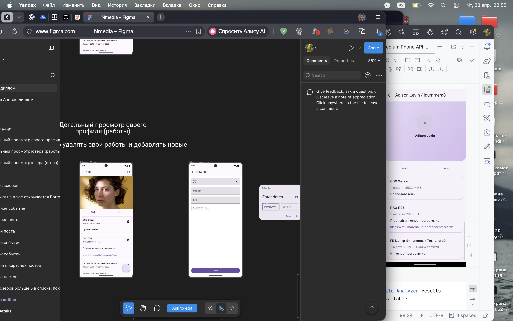
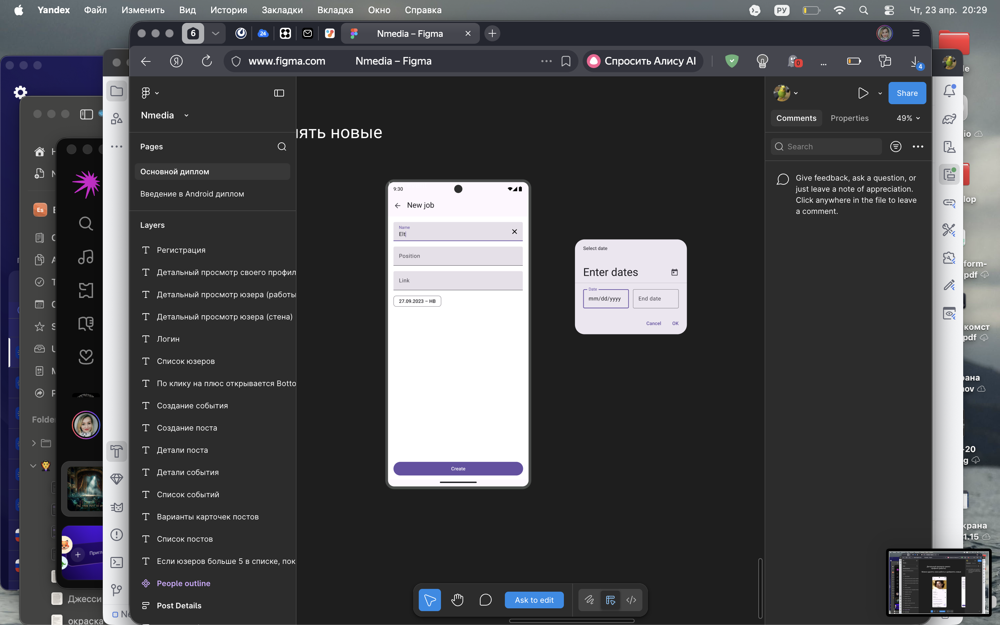

# NeWork

[](https://github.com/Cocodilla/NeWork/actions/workflows/android-ci.yml)
[](https://github.com/Cocodilla/NeWork/actions/workflows/release-apk.yml)

Android-приложение социальной сети, выполненное в рамках дипломного проекта. Приложение написано на Kotlin c использованием Jetpack Compose, Kotlin Coroutines, Retrofit и Dagger Hilt.

## Что реализовано

- лента постов, событий и список пользователей;
- вход и регистрация с локальной валидацией полей;
- просмотр профиля пользователя и своего профиля;
- просмотр стены пользователя и списка работ;
- создание, редактирование и удаление работ в своем профиле;
- создание и редактирование постов и событий для авторизованного пользователя;
- вложения для постов и событий: фото и видео;
- выбор локации и отображение карты, если подключен `MAPS_API_KEY`;
- демо-данные для аватаров, картинок и части медиаконтента, чтобы приложение выглядело живым без полного backend-наполнения.

## Стек

- Kotlin
- Jetpack Compose
- Kotlin Coroutines / Flow
- Retrofit + OkHttp + Kotlinx Serialization
- Dagger Hilt
- DataStore
- Coil
- Google Maps Compose

## Сервер

По ТЗ приложение работает с сервером `http://94.228.125.136:8080/`.

В проекте уже зашит базовый адрес:

- `BASE_URL = http://94.228.125.136:8080/api/slow/`

Для полноценной работы нужно локально задать ключи через Gradle properties:

```properties
API_KEY=your_api_key
MAPS_API_KEY=your_google_maps_key
```

Удобнее всего добавить их в пользовательский `~/.gradle/gradle.properties` или в локальный `gradle.properties`, не публикуя реальные значения в репозиторий.

## Запуск

1. Открыть проект в Android Studio.
2. Добавить `API_KEY` и при необходимости `MAPS_API_KEY`.
3. Запустить сборку `Debug`.
4. Открыть приложение на эмуляторе или устройстве с Android 7.0+.

Проверка проекта:

```bash
./gradlew clean :app:lintDebug
```

## GitHub Actions

В репозитории добавлен workflow `.github/workflows/android-ci.yml`.

Что он делает:

- на `push` в `main` и на `pull_request` запускает `lintDebug` и `assembleDebug`;
- прикладывает debug APK как artifact;
- по ручному запуску `workflow_dispatch` поднимает Android-эмулятор, устанавливает APK и запускает приложение.

Также добавлен workflow `.github/workflows/release-apk.yml`.

Что он делает:

- по ручному запуску и по тегам вида `v*` собирает release APK;
- прикладывает release APK как artifact;
- при запуске по тегу публикует APK в GitHub Releases.

Для полноценной работы workflow стоит добавить в GitHub Secrets:

- `API_KEY`
- `MAPS_API_KEY`

## Скриншоты

### Профиль и работы



### Создание работы


